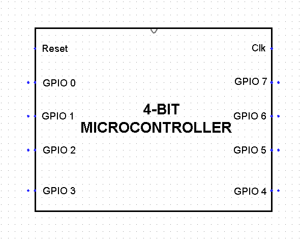
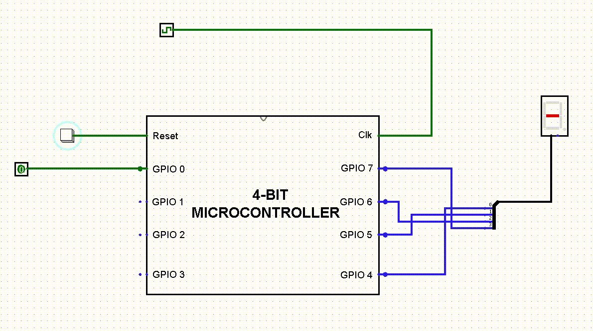

# 4-Bit-Microcontroller

## Introduction
This is a basic 4-bit microcontroller built using Logisim software, designed for educational and learning purposes. It features a custom instruction set with 16 instructions, 16 bytes of program space, and 5 bytes of nibble-addressable RAM. The microcontroller doesn't have any input/output interface, protocol support, debugging support or even assembler or compiler.
This microcontroller is not suitable for any real-time applications, it is built for learning the basics of microcontroller architecture, assembly language programming and understanding how a microcontroller works internally. The repository includes the source files for the microcontroller, schematics, documentation, and example programs. The user is expected to have basic knowledge of assembly language programming to work with this microcontroller.

## Features
- 4-bit architecture
- 8 GPIO pins
- 16 bytes of program space
- 5 bytes of RAM
- 16 instructions in instruction set

## Instruction Set

## Structure of Instruction

## Requirements
- Logisim software

## Setup and Installation
1. Download and install the Java Runtime Environment required for Logisim software from the [website](https://www.java.com/en/download/).
2. Download the Logisim software executable file from the [website](https://sourceforge.net/projects/circuit/).
3. Clone or download the source files from the GitHub repository.
4. Launch the Logisim software by opening the downloaded Logisim executable file.

  
## Glimpse of Working

## See inside the Microcontroller while it runs the program

## Getting Started
As you know the Program of any microcontroller is stored in the ROM. In this 4-bit Microcontroller we have 2 ROMs(each 16 x 4 bits), ROM1 to store the OPCODE part of Instruction and ROM2 to store the OPERAND/ADDRESS part of the Instructions. So every Instruction is 1 byte (8-bits).  
 
After Installation of Java Runtime Environment and opening Logisim software, follow these steps:
 
 
**Step 1:** Click on _File_ -> _Open_ -> Navigate to the '_Logisim files_' folder in the downloaded repository -> _Microcontroller circuits_ and open 'Up, Down Counter Program.circ' file.
 

 
 
**Step 2:** Next, Load the Example program. To open  the Microcontroller block, single click on the block to select it and then double click on the small Magnification icon. Then navigate inside the ROM block. Right click on the ROM1 block -> select _Load image_, navigate to the _Programs_ folder in the repository -> _Up, Down Counter_ Folder -> select _ROM1_. Again follow similar steps to load ROM2.
 

 
 
**Step 3:** Later, Load the RAM. Open the Microcontroller block and navigate inside _Memory Management with RAM_ block. Right click on the RAM block -> select _Load image_, navigate to the _Programs_ folder in the repository -> _Up, Down Counter_ Folder -> select _RAM_.
 

 
 
**Step 4:** Now, the Microcontroller is ready to run the Program. Select the Frequency of simulation to 64Hz for optimal view(You may increase or decrease the frequency according to your need). Start the Simulation.
 

## Contributing
Feel free to report any bugs or suggest new features by creating an issue in the GitHub repository.
## License
This project is licensed under the MIT License. You can find the full license text in the LICENSE file.
